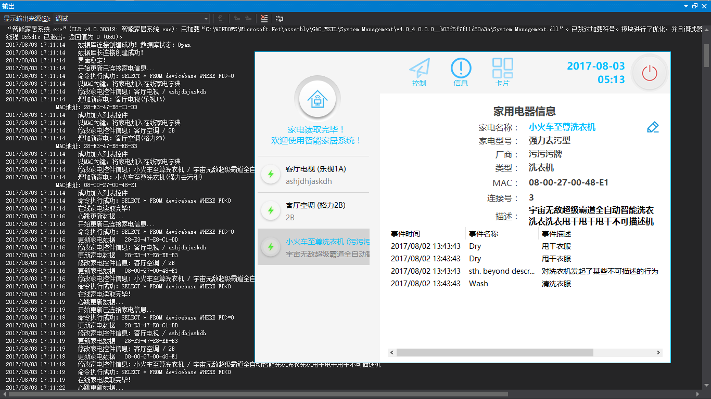

# SmartHome

> *使用此产品需遵循 [《GNU General Public License》](http://www.gnu.org/licenses/old-licenses/gpl-2.0.html) 开源许可协议*

---

### 2017年TI杯全国IoT物联网大赛 **[不存在的404]** 参赛小组入围产品PC端终端程序

> 产品名：智能家居系统

> 英文名：SmartHome ~~(不是 杀马特之家！！！)~~

---
### 截图

